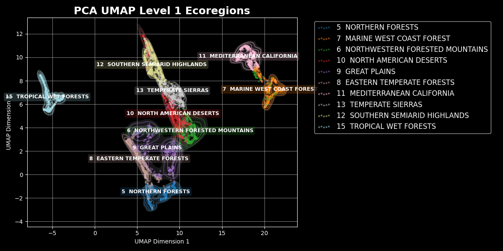
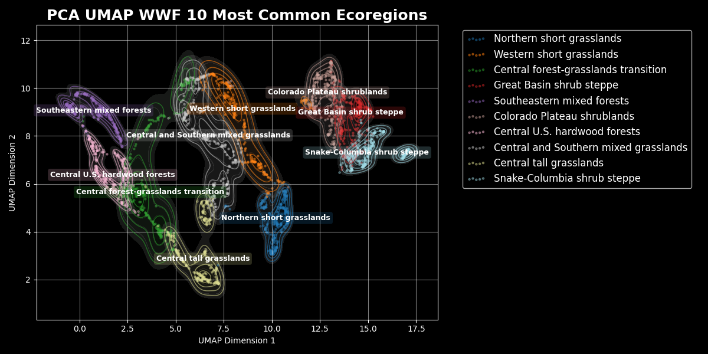
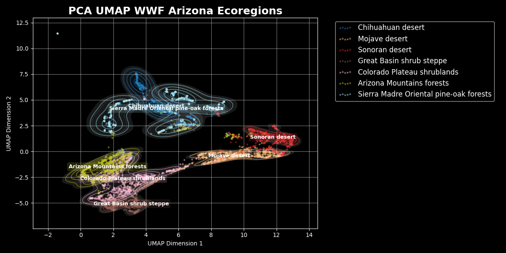
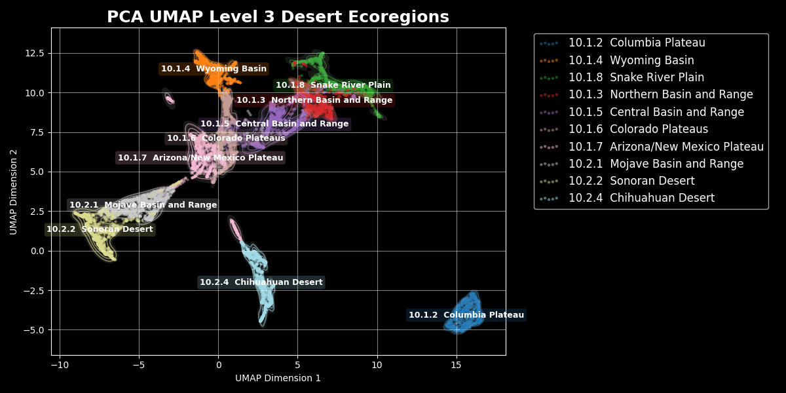

# Climatic Analysis of Ecoregions of the United States

## Data sources used in this project:
The following data sources were extracted and merged for data exploration and machine learning work. 
[AWS Open Data Terrain Tiles](https://registry.opendata.aws/terrain-tiles) Elevation data  
[EPA Ecoregions Level I, II, and III](https://www.epa.gov/eco-research/ecoregions-north-america)  
[EPA Ecoregions Level IV](https://www.epa.gov/eco-research/level-iii-and-iv-ecoregions-continental-united-states)  
[Köppen-Geiger climate classification](https://www.cec.org/north-american-environmental-atlas/climate-zones-of-north-america/)  
[Open Plant Hardiness Zones](https://github.com/kgjenkins/ophz)  
[PRISM 30 year climate norms](https://prism.oregonstate.edu/normals/) All monthly 4km resolution climate norms 
[WWF Global 200 Ecoregions](https://globil-panda.opendata.arcgis.com/maps/panda::wwf-global-200-ecoregions/about)  

## Select Unsupervised Learning Plots

    
   <em>UMAP of climatic features for EPA Level 1 Ecoregions.</em>

 

    
   <em>UMAP of climatic features for WWF Ecoregions.</em>

 

   
  <em>UMAP of climatic features for Arizona WWF Ecoregions.</em>

 

   
  <em>UMAP of climatic features for Arizona EPA Level 3 ecoregions.</em>

 

   
  <em>UMAP of climatic features for EPA Level 3 desert ecoregions.</em>

 
